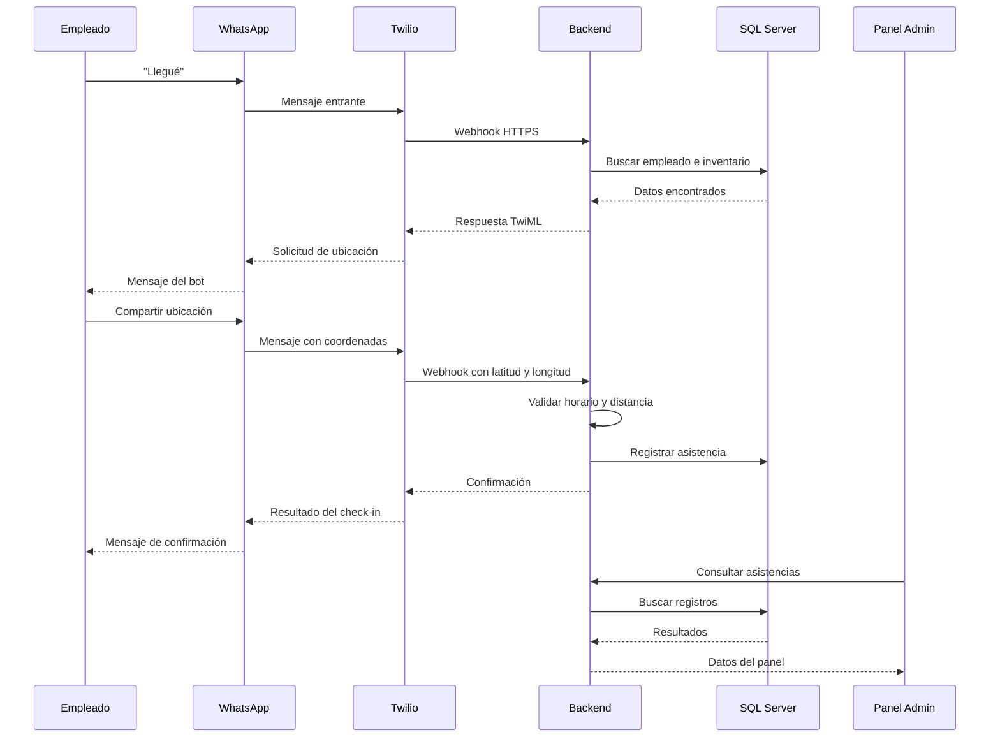

# Dinamic Attendance

Sistema interno de **Dinamic Systems** para registrar y validar la asistencia de empleados cuando llegan a una tienda a realizar un inventario físico.

---

## Descripción

**Dinamic Attendance** permite a los administradores planificar inventarios en distintas tiendas, asignar empleados y recibir confirmaciones de llegada a través de **WhatsApp**. El empleado envía un mensaje y comparte su ubicación; el sistema valida horario, asignación y distancia respecto de la tienda, y deja el resultado disponible en un panel administrativo.

La integración con WhatsApp se realiza mediante **Twilio**. El bot **no** realiza seguimiento permanente de la ubicación: solo almacena la coordenada enviada voluntariamente al momento del check-in.

---

## Problemática

Actualmente necesitamos mejorar el seguimiento de asistencia de los empleados que trabajan en inventarios físicos en distintas tiendas.

Cada inventario debe contemplar:

| Concepto | Descripción |
|----------|-------------|
| Tienda asociada | Punto de referencia geográfico del inventario |
| Fecha y horario | Ventana en la que el empleado puede registrar llegada |
| Empleados asignados | Una o más personas habilitadas para el inventario |
| Radio permitido | Distancia máxima en metros respecto de la tienda |
| Franja horaria válida | Rango horario aceptado para el check-in |

Cada tienda registra:

- nombre
- dirección
- latitud y longitud
- radio permitido en metros

Cuando un empleado llega a la tienda, envía un mensaje al número de WhatsApp de la empresa y comparte su ubicación actual. El sistema identifica al empleado, valida el inventario asignado, calcula la distancia con la fórmula de **Haversine** y registra el resultado.

---

## Objetivo

Ofrecer un flujo simple y auditable para confirmar que un empleado asignado llegó a la tienda correcta, dentro del horario y del radio geográfico configurados, sin depender de una aplicación móvil propia ni de seguimiento continuo de ubicación.

---

## Flujo de funcionamiento

### Flujo general del sistema

```text
Administrador crea una tienda
→ registra empleados
→ crea un inventario
→ asigna empleados al inventario
→ el empleado llega a la tienda
→ envía "Llegué" por WhatsApp
→ el bot solicita la ubicación
→ el empleado comparte su ubicación actual
→ el backend valida horario y distancia
→ se registra la asistencia
→ el empleado recibe una confirmación
→ el administrador visualiza el resultado
```

### Ejemplo de conversación por WhatsApp

```text
Empleado:  Llegué
Bot:       Hola, Juan. Para registrar tu llegada al inventario de
           Tienda Centro (15/06/2026), compartí tu ubicación actual
           usando el botón de ubicación de WhatsApp.
Empleado:  [comparte ubicación]
Bot:       ✅ Check-in registrado correctamente.

           Tienda: Tienda Centro
           Hora registrada: 08:57
           Distancia detectada: 42 m
           Estado: Dentro del horario permitido
```

**Caso rechazado (fuera de radio):**

```text
Empleado:  [comparte ubicación]
Bot:       ⚠️ No pudimos validar tu llegada: estás a 380 m de la
           tienda (máximo permitido: 150 m). El registro quedó
           pendiente de revisión. Contactá a tu supervisor.
```

**Caso sin inventario activo:**

```text
Empleado:  Llegué
Bot:       No encontramos un inventario asignado para vos en la
           fecha y horario actuales. Verificá con administración.
```

### Diagrama del flujo técnico



---

## Arquitectura

Arquitectura **monolítica simple**. No se prevén microservicios en la primera versión.

```text
Empleado
   ↓
WhatsApp
   ↓
Twilio
   ↓
Webhook HTTPS
   ↓
Backend Node.js + Express
   ↓
SQL Server

Administrador
   ↓
Frontend React + Vite
   ↓
Backend Node.js + Express
```

El frontend nunca accede directamente a SQL Server; siempre consulta y actualiza datos a través del backend.

| Capa | Responsabilidad |
|------|-----------------|
| WhatsApp / Twilio | Canal de mensajería y recepción de ubicación |
| Backend | Validaciones, webhooks, API REST, autenticación |
| SQL Server | Persistencia de entidades y registros |
| Frontend | Panel administrativo, mapas y consultas |

---

## Stack tecnológico

### Frontend

| Tecnología | Uso |
|------------|-----|
| React | Interfaz de usuario |
| Vite | Build y desarrollo |
| TypeScript | Tipado estático |
| React Router | Navegación |
| TanStack Query | Estado remoto y caché |
| React Hook Form | Formularios |
| Zod | Validación de esquemas |
| Material UI | Componentes visuales |
| Leaflet | Visualización de mapas |

### Backend

| Tecnología | Uso |
|------------|-----|
| Node.js | Runtime |
| Express | API REST |
| TypeScript | Tipado estático |
| JWT | Autenticación del panel |
| Twilio SDK | Mensajería WhatsApp |
| Haversine | Cálculo de distancia geográfica |

### Base de datos

| Tecnología | Uso |
|------------|-----|
| SQL Server | Almacenamiento relacional |

Entidades mínimas previstas:

- usuarios administrativos
- empleados
- tiendas
- inventarios
- empleados asignados a inventarios
- registros de asistencia
- mensajes recibidos y enviados por WhatsApp
- revisiones manuales
- sesiones temporales del bot

### WhatsApp (Twilio)

- Twilio Programmable Messaging
- Webhooks para mensajes entrantes
- Recepción de coordenadas de ubicación
- Respuestas automáticas
- Validación de firma `X-Twilio-Signature`

### Infraestructura

| Componente | Uso |
|------------|-----|
| Ubuntu | Servidor de producción |
| Docker | Contenedorización |
| Docker Compose | Orquestación local y despliegue |
| Nginx | Proxy reverso |
| Let's Encrypt | Certificados HTTPS |
| SQL Server | Contenedor o instancia externa |

---

## Funcionalidades del MVP

### Empleados

- Crear, editar y activar o desactivar empleados
- Asociar número de teléfono de WhatsApp

### Tiendas

- Crear y editar tiendas
- Cargar dirección, coordenadas y radio permitido

### Inventarios

- Crear inventarios y asociar una tienda
- Definir fecha, horario y tolerancias
- Asignar empleados
- Cambiar estado del inventario

### Asistencia (vía WhatsApp)

1. Identificar al empleado por su número de WhatsApp
2. Buscar el inventario asignado
3. Verificar fecha y horario actual
4. Recibir latitud y longitud desde WhatsApp
5. Calcular distancia entre empleado y tienda
6. Verificar si está dentro del radio permitido
7. Registrar el resultado
8. Informar si el check-in fue validado, rechazado o enviado a revisión
9. Evitar registros duplicados

### Panel administrativo

- Visualizar inventarios y empleados asignados
- Consultar asistencias con filtros por fecha, tienda y empleado
- Ver distancia detectada y estado del registro
- Revisar manualmente casos rechazados
- Visualizar la ubicación en mapa (Leaflet)

---

## Reglas de validación

Un check-in se considera **válido** cuando se cumplen **todas** estas condiciones:

```text
el teléfono pertenece a un empleado activo
AND el empleado está asignado al inventario
AND el inventario se encuentra dentro de la fecha válida
AND la ubicación fue enviada correctamente
AND la distancia es menor o igual al radio permitido
AND el horario está dentro de la ventana configurada
AND no existe un check-in previo
```

### Zona horaria

Los timestamps deben almacenarse de manera consistente, preferentemente en UTC. Para mostrar y validar horarios del MVP se utilizará la zona horaria `America/Argentina/Buenos_Aires`; el backend será la fuente de verdad para las validaciones horarias.

### Inventarios compatibles (ambigüedad)

```text
Si existe un único inventario compatible:
→ continuar el check-in.

Si existen varios inventarios compatibles:
→ pedir al empleado que seleccione la tienda o inventario.

Si no existe ninguno:
→ informar que no tiene un inventario activo.
```

### Cálculo de distancia

La distancia **no** se valida comparando coordenadas exactas. Se calcula en **metros** entre:

- las coordenadas de la tienda (latitud / longitud registradas), y
- las coordenadas recibidas desde WhatsApp.

Se utiliza la **fórmula de Haversine** sobre la superficie terrestre.

### Prevención de duplicados

Cada mensaje de Twilio incluye un `MessageSid` único. El sistema lo utiliza para evitar procesar dos veces el mismo evento y registrar check-ins duplicados.

---

## Estados del sistema

### Inventarios

| Estado | Descripción |
|--------|-------------|
| `SCHEDULED` | Planificado, aún no iniciado |
| `IN_PROGRESS` | En curso según fecha/horario |
| `COMPLETED` | Finalizado |
| `CANCELLED` | Cancelado |

### Asistencias

Para evitar que toda la evaluación dependa de un único estado, el resultado se descompone en tres campos independientes:

#### `validation_status`
| Estado | Descripción |
|--------|-------------|
| `VALID` | Check-in válido |
| `PENDING_REVIEW` | Requiere revisión manual |
| `REJECTED` | Check-in rechazado |

#### `location_status`
| Estado | Descripción |
|--------|-------------|
| `INSIDE_GEOFENCE` | Ubicación dentro del radio permitido |
| `OUTSIDE_GEOFENCE` | Ubicación fuera del radio permitido |
| `INVALID_LOCATION` | Ubicación no recibida o inválida |

#### `punctuality_status`
| Estado | Descripción |
|--------|-------------|
| `EARLY` | Check-in antes del horario esperado (si aplica) |
| `ON_TIME` | Check-in dentro de la ventana horaria configurada |
| `LATE` | Check-in dentro de tolerancia de llegada tardía |
| `OUTSIDE_TIME_WINDOW` | Fuera de la franja horaria configurada |

Errores operativos (no determinan ubicación/puntualidad):
| Estado | Descripción |
|--------|-------------|
| `ALREADY_REGISTERED` | Ya existía un check-in para ese inventario |
| `NO_ACTIVE_INVENTORY` | Sin inventario asignado en fecha/horario actual |

Esta separación permite, por ejemplo, identificar que una persona estaba en la tienda correcta pero llegó tarde.

---

## Modelo de datos general

Relaciones principales (conceptual):

```text
Usuario (admin)
Empleado ──< AsignaciónInventario >── Inventario ──> Tienda
Empleado ──< RegistroAsistencia >── Inventario
RegistroAsistencia ──> RevisiónManual (opcional)
MensajeWhatsApp ──> Empleado / SesiónBot
SesiónBot ──> Empleado (estado conversacional temporal)
```

| Entidad | Campos relevantes (referencia) |
|---------|--------------------------------|
| **Tienda** | nombre, dirección, latitud, longitud, radio (m) |
| **Empleado** | nombre, teléfono WhatsApp, activo |
| **Inventario** | tienda, fecha, hora inicio/fin, tolerancias, estado |
| **Asignación** | inventario, empleado |
| **Asistencia** | empleado, inventario, lat/lng, distancia (m), estado, timestamp |
| **Mensaje WhatsApp** | MessageSid, dirección, contenido, tipo, timestamp |
| **Revisión manual** | asistencia, usuario admin, decisión, notas |
| **Sesión bot** | empleado, paso actual, expiración |

> Los nombres de tablas, columnas y relaciones pueden ajustarse durante el desarrollo.

---

## Seguridad

- **Firma Twilio:** validar `X-Twilio-Signature` en cada webhook entrante
- **Autenticación JWT** para el panel administrativo
- **Contraseñas** almacenadas con hash (nunca en texto plano)
- **Variables sensibles** en archivo `.env` (no versionado)
- **HTTPS obligatorio** en producción
- **Validación de entrada** en API y formularios (Zod en frontend, validación en backend)
- **Control de acceso por roles** (administrador / operador según se defina)
- **Idempotencia** mediante `MessageSid` de Twilio
- **Auditoría** de modificaciones manuales en revisiones

### Auditoría mínima (requisitos)

Como mínimo, se registrará:

- fecha de creación y modificación;
- usuario que creó o modificó un inventario;
- usuario que revisó una asistencia;
- estado anterior y estado nuevo;
- motivo obligatorio de modificación manual;
- fecha y hora de la revisión.

No se diseñará todavía un sistema complejo de eventos; estos campos documentan el rastro mínimo requerido.

---

## Privacidad

- La **ubicación es un dato personal**
- Solo se solicita **durante el check-in**; no hay seguimiento en segundo plano
- Se almacena **únicamente** la ubicación enviada voluntariamente por el empleado
- El empleado debe conocer la **finalidad** del registro (confirmación de llegada al inventario)
- Los datos se conservan solo durante el **período necesario** para operación y auditoría

> La validación geográfica representa una evidencia operativa de ubicación, pero no constituye una garantía absoluta de presencia física. Los casos cercanos al límite del radio permitido podrán enviarse a revisión manual.

---

## Variables de entorno

Variables utilizadas en la base funcional actual:

```env
# Servidor
NODE_ENV=development
PORT=3000
APP_BASE_URL=http://localhost:3000
FRONTEND_URL=http://localhost:5173
TZ=America/Argentina/Buenos_Aires

# Base de datos
DB_HOST=sqlserver
DB_PORT=1433
DB_NAME=dinamic_attendance
DB_USER=sa
DB_PASSWORD=

# JWT
JWT_SECRET=
JWT_EXPIRES_IN=8h

# Twilio
TWILIO_ACCOUNT_SID=
TWILIO_AUTH_TOKEN=
TWILIO_WHATSAPP_NUMBER=whatsapp:+14155238886
TWILIO_WEBHOOK_URL=https://tu-dominio.com/api/webhooks/twilio

# Frontend (Vite)
VITE_API_URL=http://localhost:3000/api
```

Copiar los ejemplos antes de ejecutar:

```bash
cp .env.example .env
cp backend/.env.example backend/.env
cp frontend/.env.example frontend/.env
```

> **Nota:** No subir archivos `.env` al repositorio.

---

## Instalación local

### Desarrollo sin Docker

Instalar dependencias en raíz, backend y frontend:

```bash
npm install
npm --prefix backend install
npm --prefix frontend install
```

Luego iniciar frontend y backend en paralelo:

```bash
npm run dev
```

También se puede iniciar por separado:

```bash
npm run dev:backend
npm run dev:frontend
```

### Requisitos previos

- Node.js 20+
- npm
- SQL Server (contenedor Docker recomendado para esta etapa)

---

## Ejecución con Docker

```bash
docker compose up --build
```

Servicios definidos en `docker-compose.yml`:

| Servicio | Descripción |
|----------|-------------|
| `sqlserver` | SQL Server 2022 para desarrollo |
| `db-init` | Inicializacion de base `dinamic_attendance` y tablas tecnicas |
| `backend` | API Node.js + Express + TypeScript |
| `frontend` | Aplicacion React + Vite + TypeScript |

### URLs de desarrollo

```text
Frontend: http://localhost:5173
Backend: http://localhost:3000
Health: http://localhost:3000/api/health
Database health: http://localhost:3000/api/health/database
```

---

## Integración con Twilio

### Configuración general

1. Crear cuenta en [Twilio](https://www.twilio.com/)
2. Habilitar **WhatsApp** (sandbox para desarrollo o número aprobado para producción)
3. Registrar empleados con el mismo formato de teléfono que Twilio envía en webhooks (E.164)
4. Configurar el webhook de mensajes entrantes apuntando a:

   ```text
   POST https://<tu-dominio>/api/webhooks/twilio
   ```

5. Exponer la URL con **HTTPS** (ngrok en desarrollo, Let's Encrypt en producción)

### Webhook entrante

El backend debe:

1. Validar `X-Twilio-Signature`
2. Parsear tipo de mensaje (texto vs. ubicación)
3. Resolver empleado por `From` (número WhatsApp)
4. Gestionar sesión conversacional del bot (ej.: esperando ubicación)
5. Responder con TwiML o API de mensajes salientes

### Tipos de mensaje relevantes

| Tipo | Acción del sistema |
|------|-------------------|
| Texto ("Llegué", etc.) | Iniciar o continuar flujo de check-in |
| Ubicación | Validar distancia y registrar asistencia |
| Otros | Respuesta genérica o ignorar según política |

---

## Estructura del proyecto

Estructura sugerida (puede variar):

```text
dinamic-attendance/
├── backend/
│   ├── src/
│   │   ├── config/
│   │   ├── controllers/
│   │   ├── middleware/
│   │   ├── routes/
│   │   ├── services/
│   │   │   ├── attendance/
│   │   │   ├── geolocation/
│   │   │   └── twilio/
│   │   └── index.ts
│   ├── package.json
│   └── tsconfig.json
├── frontend/
│   ├── src/
│   │   ├── components/
│   │   ├── pages/
│   │   ├── hooks/
│   │   ├── services/
│   │   └── main.tsx
│   ├── package.json
│   └── vite.config.ts
├── docker/
│   └── nginx/
├── docker-compose.yml
├── .env.example
└── README.md
```

---

## Roadmap

| Fase | Alcance |
|------|---------|
| **MVP (v1)** | CRUD de tiendas, empleados e inventarios; check-in por WhatsApp; panel admin; validación Haversine; estados de asistencia |
| **v1.1** | Revisión manual mejorada, exportación de reportes, notificaciones a supervisores |
| **v1.2** | Check-out opcional, métricas de puntualidad por tienda |
| **Futuro** | Integraciones adicionales, app móvil, analítica avanzada (fuera del MVP) |

---

## Alcance no incluido

El MVP **no** incluye:

- Aplicación móvil propia
- Ubicación en tiempo real
- Seguimiento permanente de ubicación
- Reconocimiento facial
- Liquidación de sueldos
- Control biométrico
- Inteligencia artificial
- Microservicios
- Check-out (salvo que se incorpore en una fase posterior)

---

## Licencia

Proyecto de uso interno de **Dinamic Systems**. Todos los derechos reservados.

Consultar con el equipo legal o de gestión antes de distribuir, publicar o reutilizar este código fuera de la organización.

---

> **Nota de desarrollo:** Los nombres de variables de entorno, scripts npm, carpetas y convenciones de código pueden modificarse durante la implementación. Este documento describe el alcance y diseño previstos para la primera versión.
